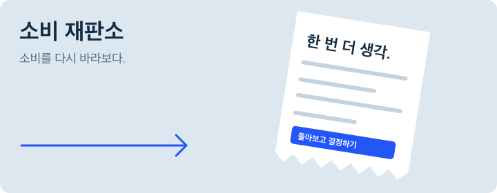
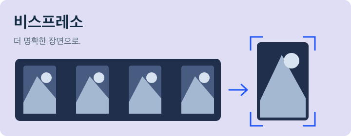
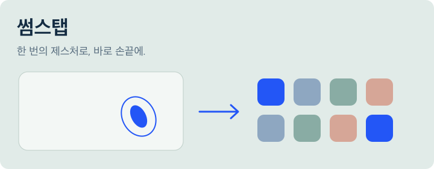

<a href="https://github.com/1jsjs">English</a> &nbsp; / &nbsp; <strong>한국어</strong>

<picture>
  <source media="(prefers-color-scheme: dark)" srcset="./assets/hero-dark-ko.svg" />
  <source media="(prefers-color-scheme: light)" srcset="./assets/hero-light-ko.svg" />
  
</picture>

 

**AI를 실제로 쓸 수 있게 만드는 일을 합니다.** 화면과 API, 그리고 그 사이의 흐름을 구현하는 박진수입니다.

[**포트폴리오**](https://parkjinsu-portfolio.vercel.app) &nbsp; / &nbsp; [**이력서**](https://parkjinsu-portfolio.vercel.app/cv) &nbsp; / &nbsp; [**jinsu.build@gmail.com**](mailto:jinsu.build@gmail.com)

## 대표 작업

<table>
<tr>
<td width="50%" valign="top">

### 소비 재판소

소비 사진을 바탕으로 질문하고 회고하는 서비스. 규칙 기반 판정과 LLM 설명을 분리했습니다.

**담당:** 기획·인프라 구축·v1/v2 전체 개발. 5인 팀 프로젝트.

`FastAPI` `Bedrock` `EC2 / S3`

호남권 SW중심대학 LLM 해커톤 장려상

[코드](https://github.com/1jsjs/sobi-tribunal) · [상세 보기](https://parkjinsu-portfolio.vercel.app/case-studies/sobi-tribunal)

</td>
<td width="50%" valign="top">

### SpeakUp

음성 인식과 LLM을 연결한 말하기 코칭. 리포트 리플레이와 MP4 내보내기를 구현했습니다.

**담당:** STT/LLM 연동·코칭 엔진·리포트. 3인 팀 프로젝트.

`음성 API` `LLM 연동`

JBNU AI·SW 경진대회 SW부문 동상

[상세 보기](https://parkjinsu-portfolio.vercel.app/case-studies/speakup)

</td>
</tr>
<tr>
<td width="50%" valign="top">

### Vispresso

AI 영상 편집 결과를 사람이 확인하고 조정하는 화면. 원본 프리뷰·타임라인·편집 구간 검수를 담당했습니다.

**담당:** 프론트엔드. 전주MBC 산학 연계, 4인 팀 프로젝트.

`영상 인터페이스` `타임라인 편집`

SW캡스톤디자인 경진대회 우수상

[상세 보기](https://parkjinsu-portfolio.vercel.app/case-studies/vispresso)

</td>
<td width="50%" valign="top">

### Thumbstap

트랙패드 엄지 더블탭으로 여는 앱 격자. 제스처 판별과 사용자 보정을 구현한 macOS 도구입니다.

**담당:** 설계·개발·배포 전 과정. 개인 프로젝트.

`Swift / SwiftUI` `Homebrew`

MIT 라이선스 오픈소스

[코드·설치 안내](https://github.com/1jsjs/thumbstap)

</td>
</tr>
</table>

## 외부 오픈소스 기여

**[Apple / coremltools](https://github.com/apple/coremltools/pull/2736)** &nbsp; · &nbsp; 2026년 6월 병합

`layer_norm`의 beta shape 검증 버그와 회귀 테스트를 수정했습니다.

## 사용하는 기술

**화면** &nbsp; React, Next.js, TypeScript, SwiftUI 
**서버** &nbsp; Python, FastAPI, Node.js, SQLite 
**AI·배포** &nbsp; OpenAI, Gemini, Amazon Bedrock, EC2, S3, Docker

지금 공부하는 것

**퓨리오사 AI 에이전트 스쿨**에서 머신러닝 기초, LLM, RAG를 공부하고 있습니다. 실습 코드는 [furiosa-practice](https://github.com/1jsjs/furiosa-practice)에 기록합니다.

전북대학교 재학·휴학 중입니다.

---

**함께 만들 기회를 찾고 있습니다.** 
AI 제품 개발·풀스택 인턴 기회에 관심이 있습니다.

[연락하기](mailto:jinsu.build@gmail.com) &nbsp; / &nbsp; [이력서 다운로드](https://parkjinsu-portfolio.vercel.app/cv.pdf)
