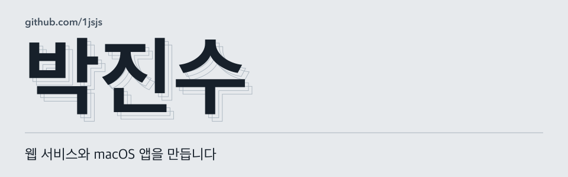
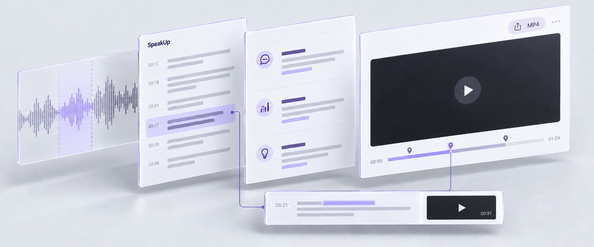
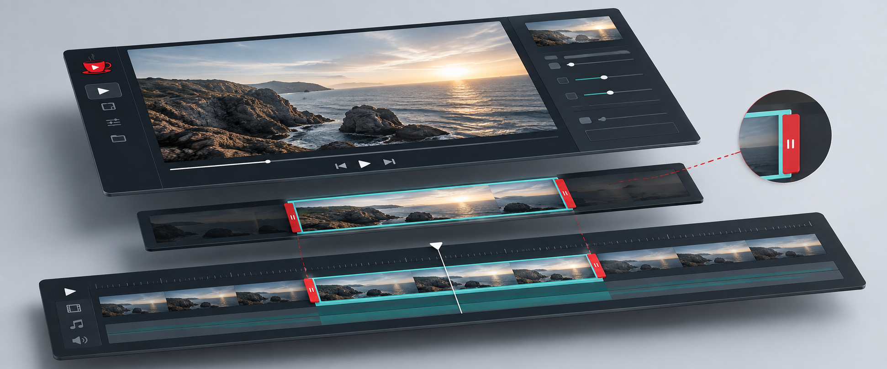

<a href="https://github.com/1jsjs">English</a> &nbsp; / &nbsp; <strong>한국어</strong>

<picture>
  <source media="(prefers-color-scheme: dark)" srcset="./assets/hero-dark-ko.svg" />
  <source media="(prefers-color-scheme: light)" srcset="./assets/hero-light-ko.svg" />
  
</picture>

 

안녕하세요. 웹 서비스와 macOS 앱을 만드는 박진수입니다. 최근에는 트랙패드 앱 런처, 말하기 코칭, 영상 편집 결과를 검수하는 화면을 만들었습니다.

[포트폴리오](https://parkjinsu-portfolio.vercel.app) &nbsp; / &nbsp; [이력서](https://parkjinsu-portfolio.vercel.app/cv) &nbsp; / &nbsp; [jinsu.build@gmail.com](mailto:jinsu.build@gmail.com)

[Apple의 coremltools에 보낸 수정도 병합됐습니다.](https://github.com/apple/coremltools/pull/2736) `layer_norm`의 beta shape 검증 버그를 고치고 회귀 테스트를 수정했습니다.

## 썸스탭

트랙패드를 엄지로 두 번 탭하면 앱 목록이 열립니다. 혼자 설계하고 개발해 공개한 macOS 앱입니다.

손가락이 닿은 면의 형태로 엄지를 구분합니다. 사용자에 맞게 보정할 수 있고, SwiftUI로 만든 앱 목록에서 검색과 배치 변경이 가능합니다.

`Swift` `SwiftUI` `Homebrew` &nbsp; MIT 라이선스 오픈소스

[제스처 판별](https://github.com/1jsjs/thumbstap/blob/178c9c6/Sources/Thumbstap/Thumbstap.swift) · [사용자 보정](https://github.com/1jsjs/thumbstap/blob/178c9c6/Sources/Thumbstap/Calibration.swift) · [앱 목록](https://github.com/1jsjs/thumbstap/blob/178c9c6/Sources/ThumbstapApp/AppGridView.swift) · [설치 안내](https://github.com/1jsjs/thumbstap#install)

## 소비 재판소

돼지 판사가 내 소비를 심문합니다. 소비 사진을 올리고 질문에 답하면, 판결을 통해 소비 습관을 돌아볼 수 있습니다.

5인 팀으로 해커톤에 참가했습니다. 기획과 인프라 구축을 맡았고, v1과 v2 코드는 모두 제가 작성했습니다. 판정은 규칙으로 처리하고, 설명은 LLM으로 생성합니다.

`FastAPI` `SQLite` `Amazon Bedrock` `EC2 / S3`

호남권 SW중심대학 LLM 해커톤 장려상.

[판정 로직](https://github.com/1jsjs/sobi-tribunal/blob/c25efc3/services/verdict_service.py) · [모델 연동](https://github.com/1jsjs/sobi-tribunal/blob/c25efc3/services/llm_service.py) · [상세 보기](https://parkjinsu-portfolio.vercel.app/case-studies/sobi-tribunal)

## 스픽업

피드백을 받은 장면을 녹화 영상에서 다시 확인할 수 있는 말하기 코칭 서비스입니다.

3인 팀에서 STT/LLM 연동과 코칭 엔진을 담당했습니다. 리포트 다시 보기와 MP4 내보내기 기능도 만들었습니다.

`음성 API` `LLM 연동` `TypeScript`

JBNU AI·SW 경진대회 SW부문 동상.

[코칭 엔진](https://github.com/eecczz/speech-coach/blob/007b080/apps/web/src/realtime-coaching.ts) · [다시 보기·내보내기](https://github.com/eecczz/speech-coach/blob/007b080/apps/web/src/report-page.ts) · [상세 보기](https://parkjinsu-portfolio.vercel.app/case-studies/speakup)

## 비스프레소

전주MBC 산학 프로젝트로 만든 영상 편집 도구입니다. AI가 추천한 구간을 편집자가 확인하고 조정할 수 있습니다.

4인 팀에서 프론트엔드를 맡았습니다. 추천 결과를 검수하는 데 필요한 원본 영상 미리보기, 타임라인, 시작·종료 지점 편집 기능을 만들었습니다.

`TypeScript` `영상 인터페이스` `타임라인 편집`

SW캡스톤디자인 경진대회 우수상.

[검수 화면](https://github.com/Me1e/jbnu_capstone_vispresso/blob/9a8ae50/src/components/job-space/segment-review-v2.tsx) · [타임라인 조작](https://github.com/Me1e/jbnu_capstone_vispresso/blob/9a8ae50/src/lib/editor-timeline.ts) · [상세 보기](https://parkjinsu-portfolio.vercel.app/case-studies/vispresso)

이미지는 각 프로젝트의 화면과 기능을 바탕으로 만든 소개 그림입니다. 실제 구현은 연결된 코드에서 확인할 수 있습니다.

## 사용하는 기술

프론트엔드: React, Next.js, TypeScript, SwiftUI 
백엔드: Python, FastAPI, Node.js, SQLite 
AI API와 배포: OpenAI, Gemini, Amazon Bedrock, EC2, S3, Docker

지금 공부하는 것

퓨리오사 AI 에이전트 스쿨에서 머신러닝 기초와 LLM, RAG를 공부하고 있습니다. 수업 실습 코드는 [furiosa-practice](https://github.com/1jsjs/furiosa-practice)에 올립니다.

전북대학교 학생이며 현재는 휴학 중입니다.

---

AI 서비스 개발이나 풀스택 인턴 자리를 찾고 있습니다.

[연락하기](mailto:jinsu.build@gmail.com) &nbsp; / &nbsp; [이력서 다운로드](https://parkjinsu-portfolio.vercel.app/cv.pdf)
