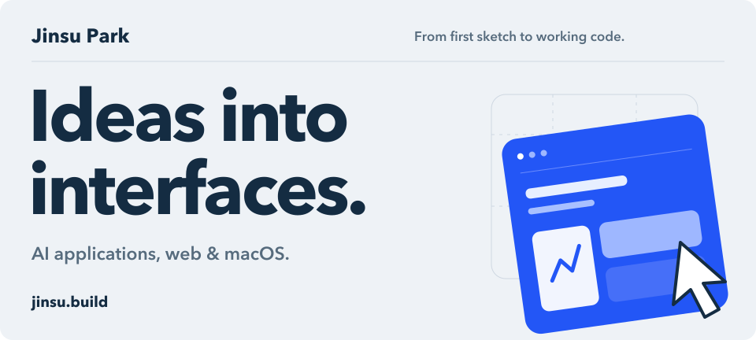
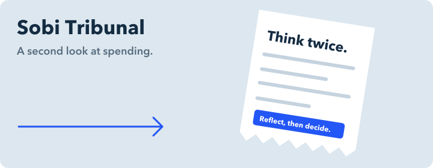
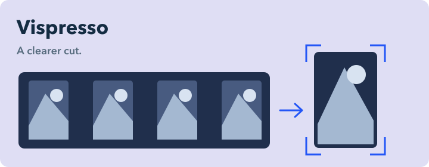
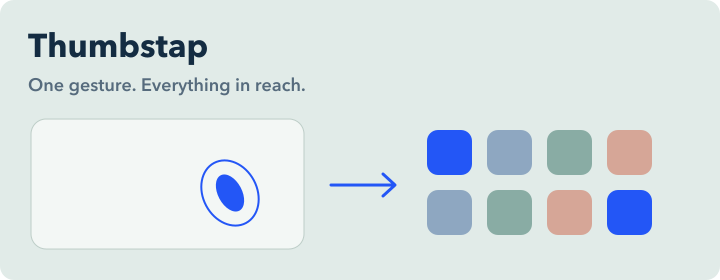

<strong>English</strong> &nbsp; / &nbsp; <a href="./README.ko.md">한국어</a>

<picture>
  <source media="(prefers-color-scheme: dark)" srcset="./assets/hero-dark.svg" />
  <source media="(prefers-color-scheme: light)" srcset="./assets/hero-light.svg" />
  
</picture>

 

**I build the parts that make AI usable.** Interfaces, APIs, and the connections between them.

[**Portfolio**](https://parkjinsu-portfolio.vercel.app) &nbsp; / &nbsp; [**Resume**](https://parkjinsu-portfolio.vercel.app/cv) &nbsp; / &nbsp; [**jinsu.build@gmail.com**](mailto:jinsu.build@gmail.com)

## Selected work

<table>
<tr>
<td width="50%" valign="top">

### Sobi Tribunal

Photo-based spending reflection with rule-based verdicts and LLM explanations.

**My role:** planning, infrastructure, all v1/v2 development. Team of 5.

`FastAPI` `Bedrock` `EC2 / S3`

Encouragement Award · Honam LLM Hackathon

[Code](https://github.com/1jsjs/sobi-tribunal) · [Story](https://parkjinsu-portfolio.vercel.app/case-studies/sobi-tribunal)

</td>
<td width="50%" valign="top">

### SpeakUp

Speech recognition and LLM coaching, with session replay and MP4 export.

**My role:** STT/LLM integration, coaching engine, reports. Team of 3.

`Speech APIs` `LLM integration`

Bronze Award · JBNU AI & SW Competition, software division

[Story](https://parkjinsu-portfolio.vercel.app/case-studies/speakup)

</td>
</tr>
<tr>
<td width="50%" valign="top">

### Vispresso

A workspace for reviewing AI video edits: source preview, timeline, and edit ranges.

**My role:** frontend. Team of 4, in collaboration with Jeonju MBC.

`Video interfaces` `Timeline editing`

Excellence Award · Software Capstone Design Competition

[Story](https://parkjinsu-portfolio.vercel.app/case-studies/vispresso)

</td>
<td width="50%" valign="top">

### Thumbstap

An app grid, a thumb double-tap away. Gesture detection and calibration for macOS.

**My role:** design, development, distribution. Solo project.

`Swift / SwiftUI` `Homebrew`

Open source · MIT license

[Code & install](https://github.com/1jsjs/thumbstap)

</td>
</tr>
</table>

## Beyond my own repos

**[Apple / coremltools](https://github.com/apple/coremltools/pull/2736)** &nbsp; · &nbsp; Merged, June 2026

Fixed `layer_norm` beta shape validation and updated its regression test.

## What I work with

**Interfaces** &nbsp; React, Next.js, TypeScript, SwiftUI 
**Services** &nbsp; Python, FastAPI, Node.js, SQLite 
**AI & deployment** &nbsp; OpenAI, Gemini, Amazon Bedrock, EC2, S3, Docker

What I'm learning now

Machine learning fundamentals, LLMs, and RAG at **Furiosa AI Agent School**. I keep the practice code in [furiosa-practice](https://github.com/1jsjs/furiosa-practice).

Jeonbuk National University student, currently on leave.

---

**Have something worth building?** 
I'm looking for internships in AI application development and full-stack engineering.

[Let's talk](mailto:jinsu.build@gmail.com) &nbsp; / &nbsp; [Download CV](https://parkjinsu-portfolio.vercel.app/cv.pdf)
