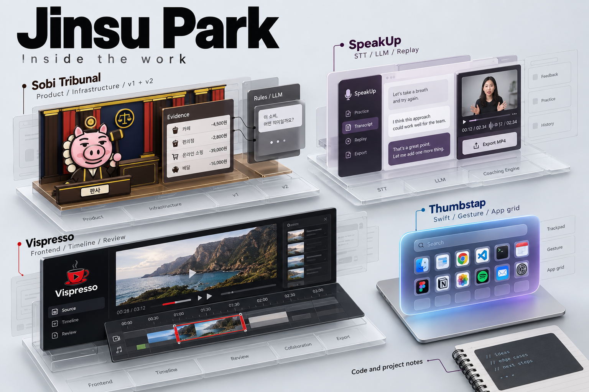
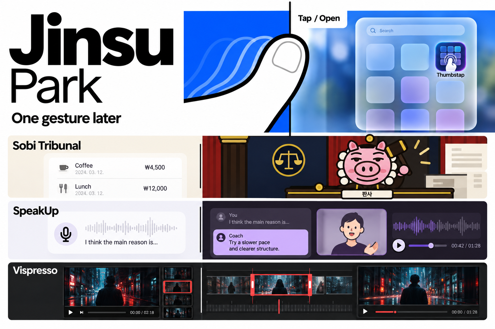
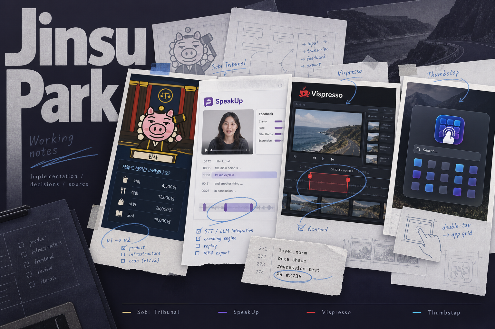

# Three directions for Jinsu's profile

These are concept illustrations, not screenshots or records of product output. They explore composition before the final README artwork. The final version uses language-neutral illustrations and native English/Korean copy.

## Cutaway — selected

Treat each app as a model that can be taken apart. A viewer should see both the interaction and the scope Jinsu implemented. Sobi includes the complete product; SpeakUp concentrates on coaching and replay; Vispresso concentrates on the review frontend; Thumbstap follows gesture recognition into the native launcher.

Use cool gray surfaces, original product colors, solid implementation layers, and restrained outlined context. The README uses full-width images so the actual interaction remains legible on a phone. Project descriptions, roles, and code links are selectable text.

The risk is making software look like invented hardware. The captions therefore identify the art as illustrations, and the technical details link directly to source. There are no invented performance measurements or customer claims.

## One gesture later

A contact sheet of actions and resulting interface states. This is the boldest typographic option and makes Thumbstap immediately understandable. It is suited to a motion study or interaction demo. A still image explains less of the implementation, so it was not chosen for this README.

## Working notes

A wall of interface prints and review annotations. It feels personal and leaves space for implementation decisions. It is better suited to a long-form case study with real sketches and development notes. Here, simulated documentary material could be confused with real artifacts, so it remains a concept only.

## What changed from the previous profile

- Replaced the generic receipt, waveform, filmstrip, cursor, and trackpad graphics.
- Replaced the four-card table with full-width project studies.
- Put the solo macOS project and a verified merged coremltools fix near the beginning.
- Kept team size and personal role explicit; no team work was relabeled as solo work.
- Removed promotional slogans and literal translation phrasing from both languages, using the Humanizer v3 skill as an editing checklist.
- Linked directly to gesture detection, calibration, verdict logic, coaching, replay, and timeline source.

This presentation is intended to make the work easier to inspect. It does not claim a hiring outcome or affiliation with Apple.
